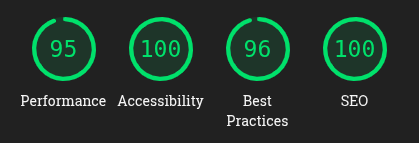
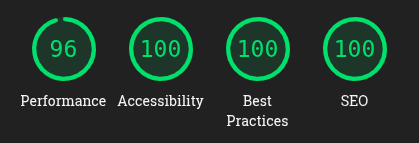

# Analytics Dashboard — Infusio

Aplicación **Analytics Dashboard** del [Proyecto IAW 2026](https://iaw-2026.github.io/proyecto/) — comisión `INFUSIO`.

Esta aplicación es desarrollada por dos integrantes de la comisión Infusio: **Emalhao Lautaro** y **Vives María de los Milagros**.

**Deploy:** https://etapa-3-analytics-dashboard-infusio.vercel.app/

---

## Descripción

El Analytics Dashboard es una herramienta de reportes consolidados que centraliza y visualiza métricas del sistema completo del ecosistema Infusio. La aplicación consulta las APIs de las cuatro webapps individuales del proyecto (Buyer, Seller, Payments y Shipping) y presenta los datos de forma unificada en un panel de administración.

### Funcionalidades principales

- **Dashboard principal:** muestra indicadores clave (KPIs) como ingresos totales, usuarios totales, pedidos confirmados, productos listados, tasa de entrega y tasa de conversión de pagos.
- **Visualizaciones:** gráficos interactivos de ingresos diarios, distribución de estados de pedidos (pie chart), ingresos mensuales e ingresos semanales, construidos con Recharts.
- **Secciones por app:** páginas dedicadas para explorar datos de Pedidos, Productos, Pagos, Envíos y Usuarios, consultando cada API del ecosistema.
- **Infusio Insights:** un módulo de análisis cruzado de las 4 apps del ecosistema que utiliza inteligencia artificial (Groq) para generar conclusiones y recomendaciones a partir de los datos consolidados.
- **Exportación:** posibilidad de exportar reportes en PDF.
- **Autenticación y autorización:** login mediante Clerk, con control de acceso por roles (solo administradores pueden acceder al dashboard).

### Tecnologías utilizadas

- **Next.js 16** con App Router y Turbopack
- **React 19** + **TypeScript**
- **Tailwind CSS 4**
- **Clerk** para autenticación y gestión de usuarios
- **Recharts** para gráficos interactivos
- **Groq SDK** para análisis con IA
- **@react-pdf/renderer** para generación de PDFs
- Desplegado en **Vercel**

---

## Acceso

| Rol           | Email               | Contraseña    |
|---------------|---------------------|---------------|
| Administrador | admin@infusio.com   | Infusio2024!  |

---

## Buenas prácticas y Optimización

Se aplicaron múltiples optimizaciones para garantizar una experiencia de usuario fluida, accesible y de alto rendimiento. En las auditorías de **Lighthouse**, la aplicación alcanza las siguientes métricas promedio:

- **Performance:** 90+
- **Accesibilidad:** 100
- **Best Practices:** 96+
- **SEO:** 100

### Optimizaciones implementadas:

1. **Lazy Loading de Gráficos (Performance):** Recharts es una biblioteca muy pesada que puede bloquear el hilo principal (incrementando el Total Blocking Time en mobile). Se implementó un componente especializado (`LazySection`) usando `IntersectionObserver` y carga dinámica de Next.js (`next/dynamic`) para diferir la descarga y ejecución del JavaScript de los gráficos hasta que el usuario hace scroll y entran en el viewport.
2. **Accesibilidad y ARIA (A11y 100%):** 
   - Todos los gráficos interactivos están envueltos en contenedores con `role="figure"` y sus respectivos `aria-label`.
   - Modales, menús y sidebars implementan controles de teclado (Eventos Escape) y landmarks semánticos.
   - Las barras de estado implementan `role="progressbar"` y valores paramétricos.
3. **Contraste WCAG AA:** Los colores del sistema fueron minuciosamente ajustados en ambos modos (Claro y Oscuro) para pasar la validación de contraste estricto (4.5:1). Por ejemplo, el texto blanco sobre fondos claros se ajusta a un texto oscuro en dark-mode dinámicamente.
4. **Optimización de Fuentes y Layout Shifting:** Se agregó `display: "swap"` a las fuentes para evitar FOUT/FOIT, y dimensiones pre-definidas en los skeletons de carga para reducir el Cumulative Layout Shift (CLS) a cero.
5. **Aislamiento de Carga (Server/Client):** Las librerías de reportes pesadas como `@react-pdf/renderer` y `groq-sdk` corren exclusivamente del lado del servidor (API Routes) para no saturar el bundle del cliente.

### 📱 Mobile

- **Performance:** 95
- **Accesibilidad:** 100
- **Best Practices:** 96
- **SEO:** 100

### 💻 Desktop

- **Performance:** 96
- **Accesibilidad:** 100
- **Best Practices:** 100
- **SEO:** 100

---

Enunciado completo: <https://iaw-2026.github.io/proyecto/>
